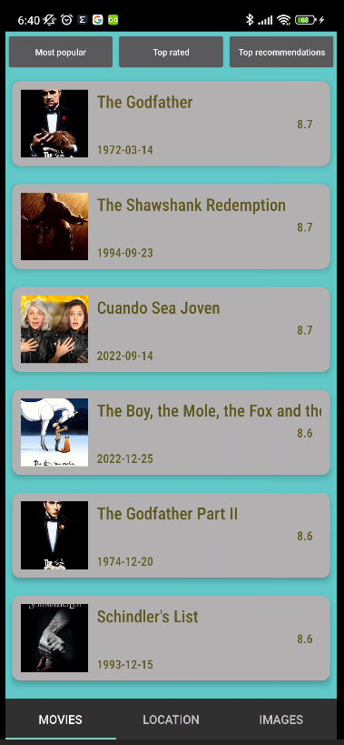
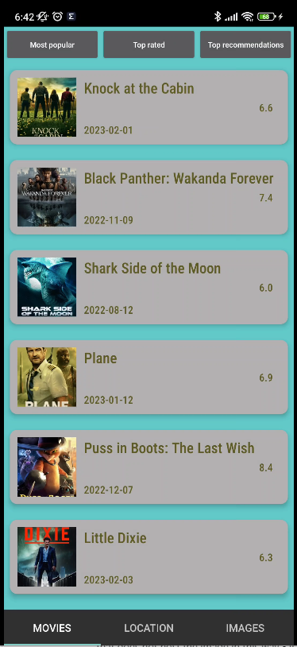
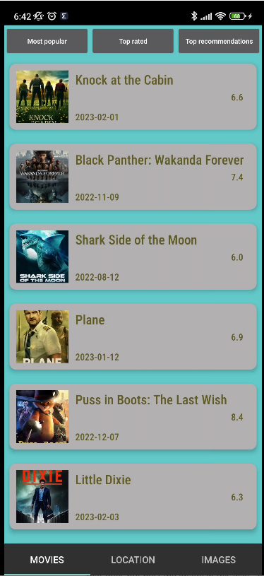
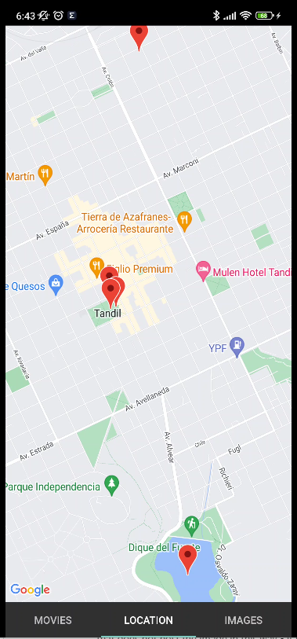
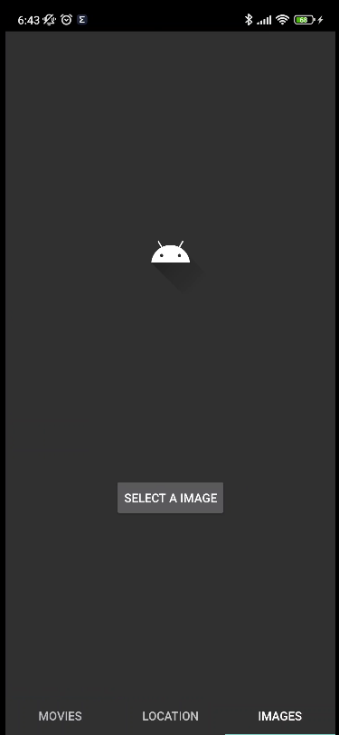
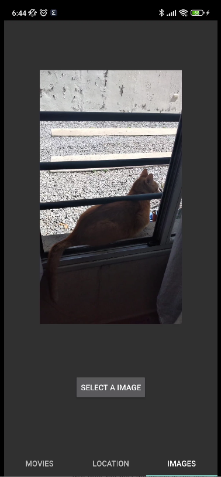
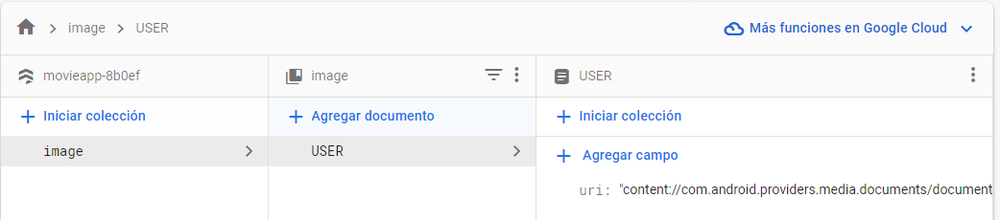

MovieApp - Nicolás Laurenti

For the realization of this application it was decided to use Clean Architecture and MVVM as
architectures, Coroutines for asynchronous calls and Hilt as DI. As for the screens, it was possible
to make 3/4 screens, which are the following:

Movies: consume three services which were selected the ones that best fit the slogan

Most Popular

Top Rated

Top Recommendations

Location: the Google maps service was used to show a map, due to lack of time it was not possible to
show the location of the device, which for that should request the "ACCESS_FINE_LOCATION" and "
ACCESS_COARSE_LOCATION" permissions and then through the function

LocationServices.getFusedLocationProviderClient( requireContext()).lastLocation
.addOnSuccessListener { location : Location? ->
// Save location and add marker
}.

 (Locations hardcoded)

Images: it was decided to give the user the possibility to select a single image for practicality
reasons and then upload it to Firestore and in the event that there is a previous image, replace it

  

While the "Profile" screen was not completed due to time constraints, it could have been done by
storing user information via EditText which could be saved to the device's local memory using
SharedPreferences, and then for reviews performing a POST with the endpoint "
/movie/{movie_id}/rating" which should be given a rating of the selected movie and also display that
information in a list where the movie title and the rating given by the user are displayed

